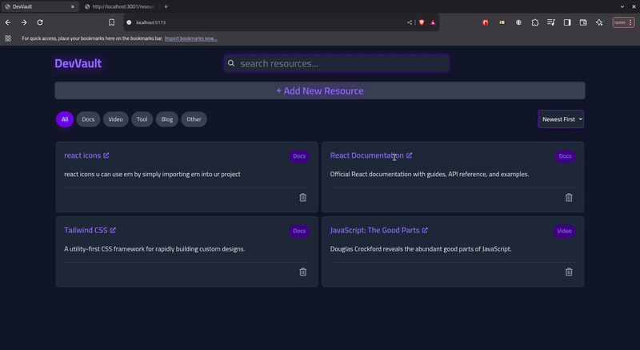

# DevVault

A lightweight developer resource manager — save, tag, search, and organize articles, tools, snippets and videos.  
Built with **Vite + React + Tailwind**. Persistence via **json-server** (prototype backend).

---

## Demo



---

## Features (implemented)

- Add resources with: `title`, `url`, `category`, and optional `notes`.
- Resource cards with category badge and link.
- Search by title/description.
- Filter by category tags.
- Sorting (date / alphabetical)
- Persistence via **json-server** (local prototype backend).
- Responsive layout (grid on desktop, stacked on mobile).
- Tailwind UI: badges, hover effects, rounded corners.

## Planned / Stretch (not implemented)

- Dark/Light theme toggle (planned)
- Favorites (star) toggle (planned)
- Production backend (Firebase, or an express API)
- Tests & CI

---

## Tech stack

- Frontend: React (Vite)
- Styling: Tailwind CSS
- Dev backend (prototype): JSON Server
- State: React hooks (useState, useEffect)

---

## Project structure

```
src/
├── App.jsx
├── components/
│ ├── AddingResourceButton.jsx
│ ├── Header.jsx
│ ├── Notification.jsx
│ ├── ResourcesDisplay.jsx
│ └── TagsFilterBar.jsx
├── main.jsx
├── index.css
└── services/
└── resources.js
```

---

## Local setup

1. Clone repo:

   ```bash
   git clone git@github.com:abdelrahmanSheref101/DevVault.git
   cd devvault
   ```

2. Install:

   ```bash
   npm install
   ```

3. Start json-server (local prototype backend):

   ```bash
   npm run json-server
   ```
   - you can change the already exsiting data from `db.json` in root of the project

4. Start the dev server:

   ```bash
   npm run dev
   ```
